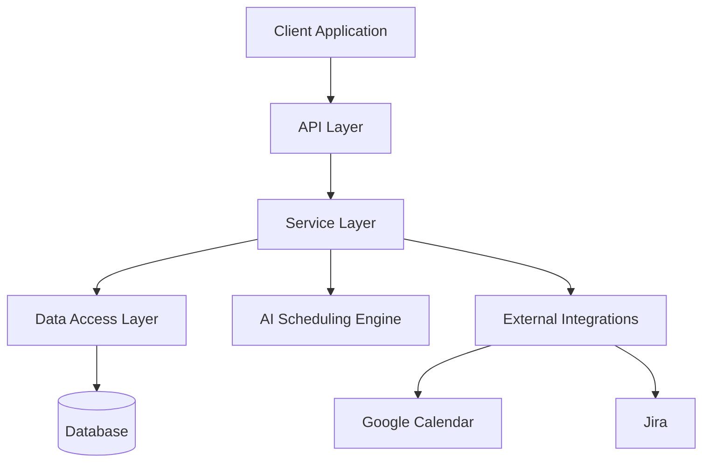
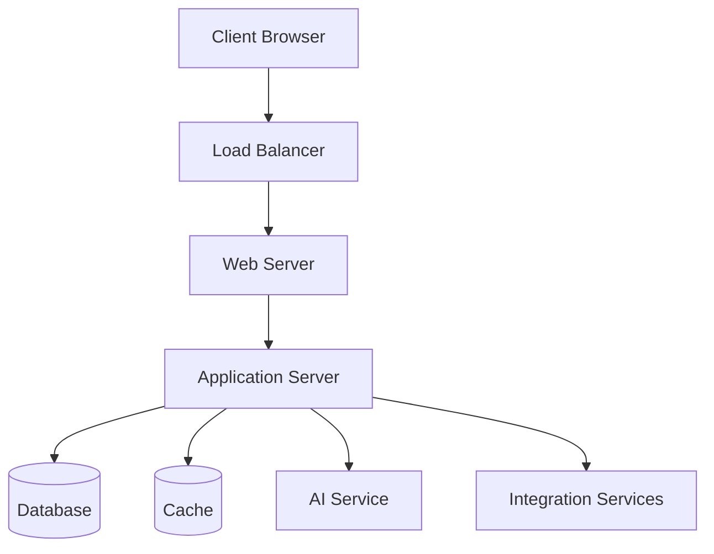

# Design Document: On-Call Rotation Calendar

## Overview

The On-Call Rotation Calendar is a web-based application designed to generate, manage, and visualize on-call schedules for distributed operations teams. The system will optimize shift assignments based on complex business rules, time zone considerations, and individual collaborator constraints while ensuring fair distribution of workload.

The application will provide an interactive interface for managers to generate schedules, make adjustments with AI assistance, and publish to external platforms. It will also offer statistical insights and maintain historical data for continuous improvement of the scheduling process.

## Architecture

The application will follow a modern web architecture with clear separation of concerns:



### Client Application
A responsive single-page application (SPA) built with modern web technologies to provide an interactive user interface for both managers and collaborators.

### API Layer
RESTful API endpoints that handle authentication, authorization, and business operations.

### Service Layer
Core business logic implementation including schedule generation, validation, and optimization.

### AI Scheduling Engine
Specialized component that implements the scheduling algorithms and provides AI-assisted recommendations for schedule adjustments.

### Data Access Layer
Abstracts database operations and provides a clean interface for data manipulation.

### External Integrations
Modules for integrating with Google Calendar and Jira for schedule publication.

### Database
Persistent storage for all application data including collaborator information, schedules, availability, and historical data.

## Components and Interfaces

### User Management Component

Responsible for authentication, authorization, and user profile management.

**Interfaces:**
- `AuthenticationService`: Handles user login, logout, and session management
- `UserService`: Manages user profiles, roles, and permissions
- `UserRepository`: Data access for user information

### Collaborator Management Component

Handles all operations related to collaborators who participate in the on-call rotation.

**Interfaces:**
- `CollaboratorService`: Manages collaborator information, time zones, and constraints
- `AvailabilityService`: Handles collaborator availability status (active, vacation, sick leave)
- `CollaboratorRepository`: Data access for collaborator information

### Schedule Generation Component

Core component responsible for creating optimized on-call schedules based on all constraints and rules.

**Interfaces:**
- `ScheduleGenerationService`: Generates schedules for specified time periods
- `ConstraintValidationService`: Validates schedules against all business rules
- `ShiftAssignmentService`: Handles the assignment of collaborators to specific shifts
- `ScheduleRepository`: Data access for schedule information

### AI Recommendation Component

Provides intelligent recommendations for schedule adjustments and optimizations.

**Interfaces:**
- `AIRecommendationService`: Generates alternative schedule options
- `OptimizationService`: Optimizes schedules based on various parameters
- `FeedbackProcessingService`: Processes manager feedback for improved recommendations

### Calendar Visualization Component

Handles the visual representation of schedules in various formats.

**Interfaces:**
- `CalendarViewService`: Provides different calendar views (daily, weekly, monthly)
- `VisualizationService`: Generates visual representations of schedules
- `ExportService`: Exports schedules to various formats

### Statistics and Analytics Component

Provides insights and analytics on schedule distribution and collaborator workload.

**Interfaces:**
- `StatisticsService`: Calculates various metrics and statistics
- `ReportGenerationService`: Generates reports based on historical data
- `AnalyticsRepository`: Data access for analytics information

### External Integration Component

Handles integration with external systems like Google Calendar and Jira.

**Interfaces:**
- `GoogleCalendarIntegrationService`: Publishes schedules to Google Calendar
- `JiraIntegrationService`: Publishes schedules to Jira
- `IntegrationConfigurationService`: Manages integration settings and credentials

## Data Models

### User
```
User {
  id: UUID
  username: String
  password: String (hashed)
  email: String
  role: Enum (ADMIN, MANAGER, COLLABORATOR)
  createdAt: DateTime
  updatedAt: DateTime
}
```

### Collaborator
```
Collaborator {
  id: UUID
  userId: UUID (foreign key to User)
  firstName: String
  lastName: String
  timeZone: String
  location: String
  birthDate: Date
  adjustedBirthDate: Date (optional)
  maxHoursPerMonth: Integer (default: 160)
  createdAt: DateTime
  updatedAt: DateTime
}
```

### Availability
```
Availability {
  id: UUID
  collaboratorId: UUID (foreign key to Collaborator)
  startDate: DateTime
  endDate: DateTime
  status: Enum (AVAILABLE, VACATION, SICK_LEAVE, TRAINING, OTHER)
  notes: String
  createdAt: DateTime
  updatedAt: DateTime
}
```

### Shift
```
Shift {
  id: UUID
  name: String
  startTime: Time
  endTime: Time
  type: Enum (MORNING, AFTERNOON, NIGHT)
  createdAt: DateTime
  updatedAt: DateTime
}
```

### Schedule
```
Schedule {
  id: UUID
  name: String
  startDate: Date
  endDate: Date
  status: Enum (DRAFT, PROPOSED, APPROVED, PUBLISHED)
  createdBy: UUID (foreign key to User)
  createdAt: DateTime
  updatedAt: DateTime
}
```

### ScheduleEntry
```
ScheduleEntry {
  id: UUID
  scheduleId: UUID (foreign key to Schedule)
  collaboratorId: UUID (foreign key to Collaborator)
  shiftId: UUID (foreign key to Shift)
  date: Date
  notes: String
  createdAt: DateTime
  updatedAt: DateTime
}
```

### ScheduleProposal
```
ScheduleProposal {
  id: UUID
  scheduleId: UUID (foreign key to Schedule)
  proposalNumber: Integer
  status: Enum (PENDING, ACCEPTED, REJECTED)
  managerFeedback: String
  createdAt: DateTime
  updatedAt: DateTime
}
```

### WorkHourStatistics
```
WorkHourStatistics {
  id: UUID
  collaboratorId: UUID (foreign key to Collaborator)
  month: Integer
  year: Integer
  totalHours: Decimal
  morningShiftHours: Decimal
  afternoonShiftHours: Decimal
  nightShiftHours: Decimal
  createdAt: DateTime
  updatedAt: DateTime
}
```

### IntegrationConfig
```
IntegrationConfig {
  id: UUID
  type: Enum (GOOGLE_CALENDAR, JIRA)
  configData: JSON
  isActive: Boolean
  createdAt: DateTime
  updatedAt: DateTime
}
```

## Error Handling

The application will implement a comprehensive error handling strategy:

1. **Validation Errors**: Client-side and server-side validation with descriptive error messages
2. **Business Rule Violations**: Clear explanations when schedule generation violates business rules
3. **Integration Errors**: Robust handling of external system integration failures
4. **Concurrency Issues**: Optimistic locking to prevent conflicting updates
5. **Logging**: Structured logging with appropriate severity levels
6. **Error Reporting**: Centralized error reporting with notification capabilities

### Error Response Structure
```
ErrorResponse {
  code: String
  message: String
  details: Array<String>
  timestamp: DateTime
  path: String
  correlationId: UUID
}
```

## Testing Strategy

### Unit Testing
- Test individual components and services in isolation
- Mock dependencies to focus on specific functionality
- Achieve high code coverage for core business logic

### Integration Testing
- Test interactions between components
- Verify database operations and external integrations
- Use test containers for database testing

### End-to-End Testing
- Test complete user workflows
- Verify UI interactions and API responses
- Simulate real-world scenarios

### Performance Testing
- Test schedule generation performance with large datasets
- Verify system responsiveness under load
- Identify and address bottlenecks

### Acceptance Testing
- Verify that the system meets all requirements
- Validate business rules implementation
- Ensure usability for all user roles

## Security Considerations

1. **Authentication**: Implement secure authentication using industry standards (OAuth 2.0, JWT)
2. **Authorization**: Role-based access control for different user types
3. **Data Protection**: Encrypt sensitive data at rest and in transit
4. **Input Validation**: Thorough validation of all user inputs
5. **API Security**: Rate limiting, CORS configuration, and request validation
6. **Audit Logging**: Track all significant system events and user actions

## Deployment Architecture



The application will be deployed using containerization for scalability and consistency across environments. A CI/CD pipeline will automate testing and deployment processes.

## User Interface Design

### Dashboard View
- Overview of current schedule
- Quick access to key functions
- Summary statistics and alerts

### Calendar View
- Interactive calendar with different time scales (day, week, month)
- Color-coded shifts and collaborators
- Drag-and-drop interface for manual adjustments

### Schedule Generation Interface
- Date range selection
- Constraint configuration
- AI recommendation display with comparison table
- Feedback mechanism for rejected proposals

### Collaborator Management Interface
- List and detail views
- Availability management
- Historical data visualization

### Statistics and Reports Interface
- Interactive charts and graphs
- Customizable reports
- Export functionality

## Accessibility Considerations

1. **WCAG Compliance**: Adhere to Web Content Accessibility Guidelines
2. **Keyboard Navigation**: Full functionality without requiring a mouse
3. **Screen Reader Support**: Proper ARIA attributes and semantic HTML
4. **Color Contrast**: Ensure sufficient contrast for all visual elements
5. **Responsive Design**: Support for various devices and screen sizes

## Internationalization

1. **Multi-language Support**: Infrastructure for translating UI elements
2. **Time Zone Handling**: Proper display of times in user's local time zone
3. **Date and Number Formatting**: Locale-specific formatting

## Performance Optimization

1. **Caching Strategy**: Cache frequently accessed data
2. **Lazy Loading**: Load data and components as needed
3. **Database Optimization**: Proper indexing and query optimization
4. **Front-end Performance**: Bundle optimization, code splitting, and lazy loading

## Future Considerations

1. **Mobile Application**: Native mobile apps for on-the-go access
2. **Advanced Analytics**: Machine learning for pattern recognition and optimization
3. **Additional Integrations**: Support for more calendar and project management systems
4. **Notification System**: Push notifications and email alerts for schedule changes